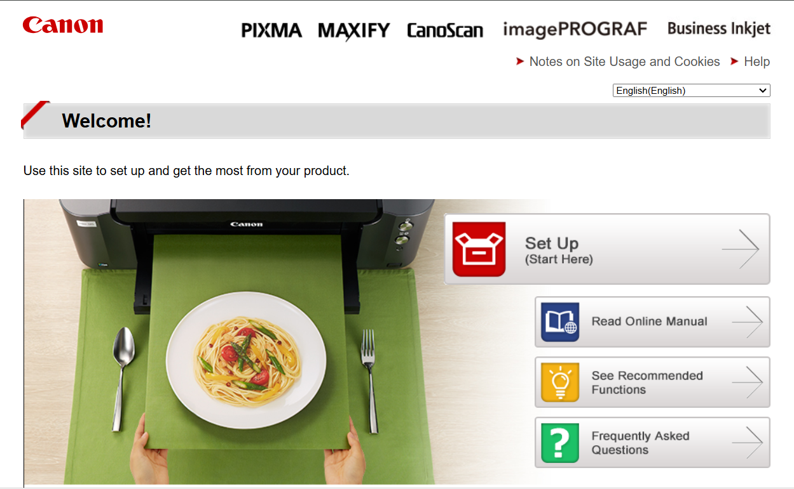

# IJ Start Canon: Your Ultimate Resource for Canon Printer Setup

  

Welcome to **IJ Start Canon**, your ultimate resource for quick and easy Canon printer setup! Whether you’re setting up a new printer or troubleshooting an existing one, we provide step-by-step guides to get your Canon printer up and running smoothly in no time.

---

## How to Set Up Your Canon Printer: Step-by-Step Guide

Setting up your Canon printer has never been easier! Just follow the steps below for a seamless installation process.

### Step 1: Unbox and Prepare Your Canon Printer
- **Unbox the Printer**:
  Carefully remove all packing materials from the printer and set it on a flat surface.
  
- **Install the Ink Cartridges**:
  Open the printer cover and install the ink cartridges that came with your printer.
  
- **Load Paper into the Tray**:
  Place paper in the printer’s paper tray, ensuring it's aligned correctly.

### Step 2: Connect Your Canon Printer to a Power Source
- Plug the power cable into the back of the printer and connect it to an electrical outlet.
- Turn the printer on by pressing the power button.

### Step 3: Connect Your Printer to Wi-Fi

#### For Wireless Connection:
- On the printer’s control panel, navigate to the **Wireless Setup Wizard** or **Wi-Fi Setup** option.
- Select your Wi-Fi network from the list and enter your network password.
- Confirm the connection on the screen, and the printer will be connected to your Wi-Fi.

#### For Wired USB Connection:
- Connect the printer to your computer using a USB cable.
- The printer will be automatically detected on your computer.

### Step 4: Install Canon Printer Drivers
- Go to the **Canon Support Website**.
- Enter your printer model in the search box.
- Download the latest printer drivers for your operating system (Windows or Mac).
- Run the installer and follow the on-screen instructions to complete the installation.

### Step 5: Add the Printer to Your Device

#### On Windows:
- Go to **Control Panel** > **Devices and Printers** > **Add a Printer**.
- Select your Canon printer from the list and follow the prompts to add it.

#### On Mac:
- Open **System Preferences** > **Printers & Scanners** > **Add Printer**.
- Select your Canon printer and click **Add**.

### Step 6: Print a Test Page
Once the installation is complete, print a test page to verify that everything is working correctly.

---

  

---
## Canon Printer Apps for Easy Printing

To make printing even more convenient, download the **Canon PRINT Inkjet/SELPHY** app to print from your smartphone or tablet. Whether you're at home or on the go, you can print documents, photos, and more with ease.

---

## Troubleshooting Common Canon Printer Issues

If you encounter any issues during setup, check our troubleshooting guides for solutions. Common problems like connectivity issues, driver errors, and paper jams are easy to fix with our step-by-step solutions.

---

## Why Choose Canon?

Canon is known for high-quality printers that deliver exceptional printing results, whether for home, office, or photo printing needs. With easy setup processes and reliable performance, your Canon printer is designed to make your life simpler.

---

## Get Started with Your Canon Printer Today!

Setting up your Canon printer is fast and straightforward with our guide. Follow these steps and enjoy hassle-free printing today!

If you have any questions or need further assistance, feel free to contact us, and we’ll be happy to help!

---

Thank you for choosing IJ Start Canon!
